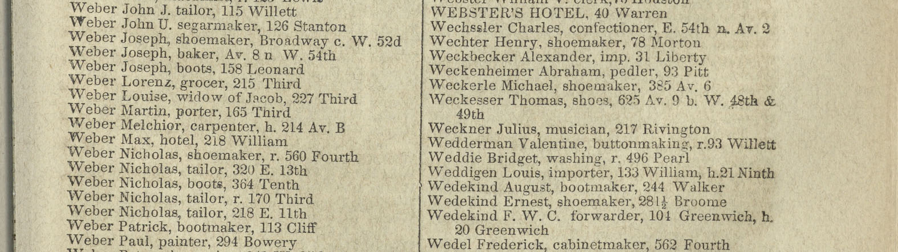

# NYC City Directory - OCR Scripts

Takes a directory containing scans of New York City Directories, and runs [OCRopus](https://github.com/tmbdev/ocropy) — a set of open source OCR and document analysis tools — to extract text data from those scans.

The script in this repository reads a directory of image files, runs OCRopus using a model trained on NYC city directories, and produces an [hOCR file](https://en.wikipedia.org/wiki/HOCR) containing detected text segments and their pixel position in the image.

While City Directories can contain different types of pages (i.e. advertisements, tables with street names), this script focuses on extracting data from the two-column pages listing people and their professions and addresses (see the example above).

For more example pages, see the [`example-pages`](example-pages) directory.

## NYC Space/Time Directory

NYPL's [NYC Space/Time Directory](http://spacetime.nypl.org/) project aims to show the history of NYC's businesses and  professions on a map:

1. Make [high-res scans of all volumes of City Directories](http://digitalcollections.nypl.org/collections/new-york-city-directories#/?tab=about)
2. Use *this script* to extract text data from those scans
3. Detect columns and indented text and create a file containing all relevant lines — see https://github.com/nypl-spacetime/hocr-detect-columns
4. Use [conditional random fields](https://en.wikipedia.org/wiki/Conditional_random_field) to extract `name`, `profession` and `address` fields from those lines — see https://github.com/nypl-spacetime/crf-classify

## OCRopus

This script uses OCRopus (Or ocropy? [There seems to be no agreement on the name](https://github.com/tmbdev/ocropy/issues/97)...) for binarization, page segmentation and OCR. OCRopus [does not seem to be under very active development](https://github.com/tmbdev/ocropy/commits/master) but it's — once set-up — easy to train and tweak. Maybe we should [Tesseract](https://github.com/tesseract-ocr/tesseract) instead, one day.

## Training data

The [`models`](models) directory contains models trained on manually transcribed text segments from our City Directory collections. See the [See also](#see-also) section on how to train OCRopus.

## Installation

See https://github.com/tmbdev/ocropy#installing.

On my MacBook with HomeBrew installed, this worked:

    brew install hdf5

    pip install --upgrade pip
    pip install pylab
    pip install lxml

    git clone https://github.com/tmbdev/ocropy.git
    cd ocropy

    virtualenv ocropus_venv/
    source ocropus_venv/bin/activate
    pip install -r requirements_1.txt
    pip install -r requirements_2.txt

    python setup.py install

Afterwards, you can run the OCRopus tools (e.g. `ocropus-nlbin`, `ocropus-gpageseg`, `ocropus-rpred`, `ocropus-hocr`) from this virtual environment.

## Usage

    cd ocropy
    source ocropus_venv/bin/activate
    /path/to/ocr-scripts-dir/run.sh /path/to/images/*.tif

`run.sh` will create `hocr.html` in `/path/to/images` (and OCRopus' intermediate output files are in `/path/to/images/temp`).

## See also

[Dan Vanderkam's blog](http://www.danvk.org/blog.html) (the creator of [OldNYC](https://www.oldnyc.org/)) has a few posts dedicated to using and training OCRopus:

- [Finding blocks of text in an image using Python, OpenCV and numpy](http://www.danvk.org/2015/01/07/finding-blocks-of-text-in-an-image-using-python-opencv-and-numpy.html)
- [Extracting text from an image using Ocropus](http://www.danvk.org/2015/01/09/extracting-text-from-an-image-using-ocropus.html)
- [Training an Ocropus OCR model](http://www.danvk.org/2015/01/11/training-an-ocropus-ocr-model.html)
